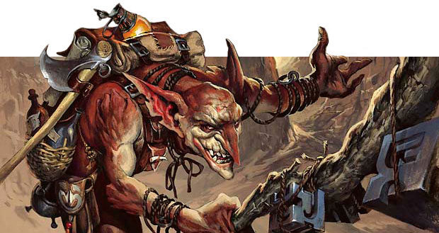

# The Goblin Shortcutter

Welcome friend, I am the Goblin Shortcutter,
And I will be your humble javascript helper,
to find your way to the cards that you want.

<div align="center">
  
</div>

To use me is simple, 
install me and require me,
Then simply call me with the name that you want.

In the terminal:
`npm i the-goblin-shortcutter`

In your code:
```
const goblinShortcutter = require('the-goblin-shortcutter');
let card;
card = goblinShortcutter("Krenko mob boss");
console.log("This is your card:", card);
```

I'll return to you as fast as possible,
With a single name or list of names, 
Depending on the match that I found.

*Artwork by [Jesper Ejsing](http://jesperejsing.com/)*